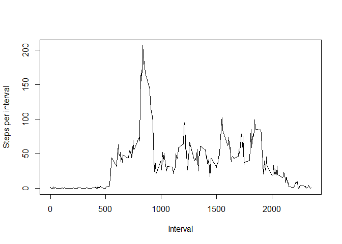

# Reproducible Research: Peer Assessment 1

## Loading and preprocessing the data

We start by reading the csv file from the zip and parsing the dates.


```r
library(plyr, warn.conflicts = FALSE, quietly = TRUE)
library(dplyr, warn.conflicts = FALSE, quietly = TRUE)
library(data.table, warn.conflicts = FALSE, quietly = TRUE)
activity <- unz("activity.zip", "activity.csv") %>%
        read.csv(header = TRUE) %>%
        data.table %>%
        mutate(date = as.Date(date))
```

## What is mean total number of steps taken per day?

Here is a histogram of the number of steps taken per day.
Missing values are ignored.


```r
with (activity %>%
                filter(complete.cases(steps)) %>%
                ddply(~date,summarise,steps=sum(steps)), {
        hist(steps, col="red", main="", xlab="Steps per day", breaks=20)
        summaryStepsPerDay <<- summary(steps)[c("Mean", "Median")]
})
```

 

The mean and median of the number of steps taken per day are:


```r
summaryStepsPerDay
```

```
##   Mean Median 
##  10770  10760
```

## What is the average daily activity pattern?

Here is time series plot of average numbers of steps taken per interval,
averaged accross all days. Missing values are ignored. Note that it might be
more insightful to parse the interval (which seems to be 100 * hours + minutes)
as a proper time variable. This transformation was omitted as it was clearly
not intended in this assignment. 


```r
with (activity %>%
                filter(complete.cases(steps)) %>%
                ddply(~interval,summarise,steps=mean(steps)), {
        plot(steps ~ interval,
             type="l",
             xlab = "Interval",
             ylab = "Steps per interval")
        # maxInterval is used to insert the value in the next sentence.
        maxInterval <<- interval[which.max(steps)]
})
```

 

The maximum for the average daily activity is reached at the 5-minute
interval starting at 835.

## Imputing missing values

Missing values for steps are filled with the mean number of steps for the
given interval over the (other) days. The mean is more appropriate than the
median because of the skewed distribution of the number of steps per interval.


```r
imputSteps <- with(activity %>%
                filter(complete.cases(steps)) %>%
                ddply(~interval,summarise,steps=round(mean(steps))), {
        function (x) steps[interval == x]
})
noNaActivity <- activity
noNaActivity$steps[!complete.cases(activity$steps)] <-
        activity$interval[!complete.cases(activity$steps)] %>%
        sapply(imputSteps) %>%
        unlist
```

Here is a histogram of the number of steps taken per day after substituting
the median for the missing values.


```r
with (noNaActivity %>%
                filter(complete.cases(steps)) %>%
                ddply(~date,summarise,steps=sum(steps)), {
        hist(steps, col="red", main="", xlab="Steps per day", breaks=20)
        summaryStepsPerDay2 <<- summary(steps)[c("Mean", "Median")]
})
```

 

The mean and median of the number of steps taken per day are now:


```r
summaryStepsPerDay2
```

```
##   Mean Median 
##  10770  10760
```

As can be seen, the mean and median are equal to that of the original set.
This is not completely surprising, as the substitution of the missing data
was chosen carefully to minimize impact on the mean. And with the median so
close to the mean, it turned out to be unaltered as well.

### Impact of imputing on the estimates of the total daily number of steps

The distribution did change significantly however, as can be seen in the
histogram: the central bar far outgrows its peers. This would mean that the
confidence interval when estimating total number of steps per day would narrow.
This sounds nice, but in fact this does not make sense: the imputed data cannot
be used for estimation, especially when a complete day is missing.

## Are there differences in activity patterns between weekdays and weekends?

For each measurement the type of day (weekend or weekday) was determined.


```r
areWeekends <- function(dates) {
        isWeekend <- function(date) date %>%
                weekdays %>%
                intersect(c("Sunday", "Saturday")) %>%
                length %>%
                function (s) if (s) "weekend" else "weekday"
        types <- dates %>% sapply(isWeekend) %>% unlist
}
dayTypeActivity <- noNaActivity %>%
        mutate(dayType = as.factor(areWeekends(date)))
```

The following plot compares activity patterns for weekend days and other
days of the week.


```r
library(lattice, warn.conflicts = FALSE, quietly = TRUE)
with (dayTypeActivity %>%
        ddply(.(interval,dayType),summarise,steps=mean(steps)), {
        xyplot(steps ~ interval | dayType,
               type = "l",
               layout = c(1,2),
               xlab = "Interval",
               ylab = "Steps per interval")
})
```

 

The weekday pattern seems to be more extreme. This is possibly due to people
more adhering to a regime (and a similar regime!) on weekdays than in weekends.
More research is necessary to confirm this.
